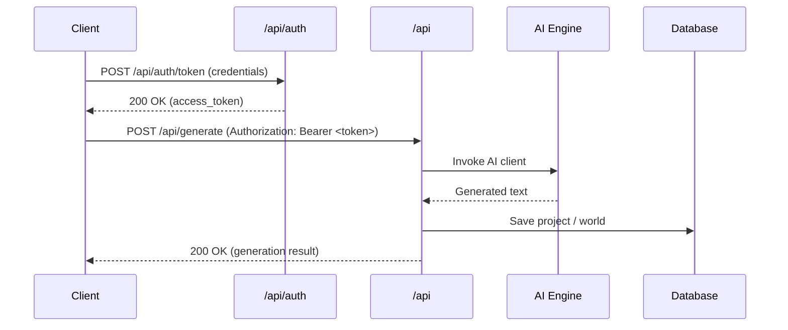

# Backend Architecture for Learners

Goal: Make the `backend/` codebase easy to understand by mapping each backend file and endpoint to the frontend components that call it, providing minimal example requests/responses, a Mermaid sequence diagram, a mock server, and runnable examples.

## Quick Start
- Open the small docs in `backend/docs/components/` for focused explanations (one per backend module).
- Run the mock server to exercise example flows:

```powershell
cd f:\Project\Anime-Script-Pro
python -m uvicorn backend.docs.mock_server.app:app --reload --port 8082
```

- The mock server will start on `http://127.0.0.1:8082`.

## Core Flows (examples)
1. Login / Token issuance
2. Generate content (AI)
3. Save project / Fetch project

## Mermaid sequence (high-level)



## Contents
- `backend/docs/COMPLETE_API_REFERENCE.md` — **Complete mapping of all 24 API routers, generators, services, and database models** (START HERE for comprehensive overview)
- `backend/docs/components/` — per-file small docs (one per backend module)
- `backend/docs/examples/` — example JSON payloads you can reuse
- `backend/docs/mock_server/` — small FastAPI mock to try requests
- `backend/docs/diagram.mmd` — mermaid source

## Example curl (login + generate)

```bash
# Login (dev bypass or real credentials)
curl -X POST http://127.0.0.1:8082/api/auth/token -H "Content-Type: application/json" -d '{"email":"email@gmail.com","password":"password"}'

# Use returned token to call generate
curl -X POST http://127.0.0.1:8082/api/generate \
  -H "Authorization: Bearer test-token" \
  -H "Content-Type: application/json" \
  -d @backend/docs/examples/generate_request.json
```

## How to use these docs
- Open `backend/docs/components/api.ai.md` and `backend/docs/components/api.auth.md` to see the simplest, most-used endpoints.
- Start the mock server and run the example curl commands above to practice the flows locally.

If you want, I can now generate all remaining per-file doc pages in batches by folder (start with `backend/api/`).
