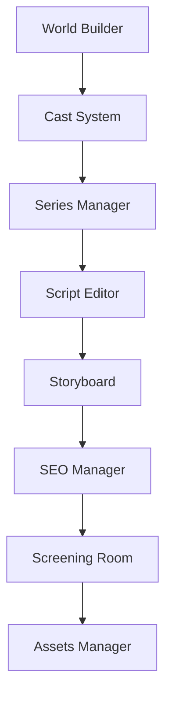

# Anime Studio Architecture

This document captures the core Anime production pipeline and the tabs that make up each module.

## Production Flow

1. World Builder establishes the setting.
2. Cast System turns the setting into characters and relationships.
3. Series Manager turns characters and world state into episode structure.
4. Script Editor turns the series structure into dialogue and scenes.
5. Storyboard turns the script into visual planning.
6. SEO Manager turns the output into publishable metadata.
7. Screening Room validates and previews the result.
8. Assets Manager organizes the final deliverables.

## Module Tabs

<h3 style="margin: 24px 0 12px; padding: 10px 14px; border-left: 4px solid #06b6d4; background: #0f172a; color: #e2e8f0; border-radius: 8px; font-weight: 700; letter-spacing: 0.02em;">World Builder</h3>

| Order | Tab | Purpose |
|---|---|---|
| 1 | Manifest | World overview and founding rules |
| 2 | History | Timeline and civilization history |
| 3 | Factions | Groups, alliances, and organizations |
| 4 | Powers | Magic systems and abilities |
| 5 | Architecture | Built environments and structure |
| 6 | Atlas | Geography and locations |
| 7 | Culture | Customs, beliefs, and norms |
| 8 | Systems | World logic and governing rules |

<h3 style="margin: 24px 0 12px; padding: 10px 14px; border-left: 4px solid #06b6d4; background: #0f172a; color: #e2e8f0; border-radius: 8px; font-weight: 700; letter-spacing: 0.02em;">Cast System</h3>

| Order | Tab | Purpose |
|---|---|---|
| 1 | Registry | Character index and overview |
| 2 | Manifest | Character profiles and details |
| 3 | Matrix | Relationship mapping |
| 4 | Trait Analysis | Character DNA and psychology |
| 5 | Dynamics | Interaction patterns |
| 6 | Integrity | Continuity and consistency checks |
| 7 | Add Lead | Fast lead creation |

<h3 style="margin: 24px 0 12px; padding: 10px 14px; border-left: 4px solid #06b6d4; background: #0f172a; color: #e2e8f0; border-radius: 8px; font-weight: 700; letter-spacing: 0.02em;">Series Manager</h3>

| Order | Tab | Purpose |
|---|---|---|
| 1 | Roadmap | Episode checklist and delivery path |
| 2 | Episodes | Episode list and metadata |
| 3 | Blueprint | Structural narrative map |
| 4 | Arcs | Story arc library |
| 5 | Assets | Linked production resources |
| 6 | Timeline | Chronological planning |

<h3 style="margin: 24px 0 12px; padding: 10px 14px; border-left: 4px solid #06b6d4; background: #0f172a; color: #e2e8f0; border-radius: 8px; font-weight: 700; letter-spacing: 0.02em;">Script Editor</h3>

| Order | Tab | Purpose |
|---|---|---|
| 1 | Teleprompter | Primary script editing surface |
| 2 | Linguistics | Dialogue language and style analysis |
| 3 | Beat Sheet | Emotional pacing and scene rhythm |
| 4 | Dialogue | Conversation and line management |
| 5 | Metadata | Script configuration and technical data |

<h3 style="margin: 24px 0 12px; padding: 10px 14px; border-left: 4px solid #06b6d4; background: #0f172a; color: #e2e8f0; border-radius: 8px; font-weight: 700; letter-spacing: 0.02em;">Storyboard</h3>

| Order | Tab | Purpose |
|---|---|---|
| 1 | Frame Matrix | Scene frames and grid layout |
| 2 | Shot Angles | Camera position and shot types |
| 3 | Composition | Visual layering and arrangement |
| 4 | Animatic | Motion preview and sequencing |
| 5 | Audio Sync | Sound and timing alignment |

<h3 style="margin: 24px 0 12px; padding: 10px 14px; border-left: 4px solid #06b6d4; background: #0f172a; color: #e2e8f0; border-radius: 8px; font-weight: 700; letter-spacing: 0.02em;">SEO Manager</h3>

| Order | Tab | Purpose |
|---|---|---|
| 1 | Keywords | Search terms and keyword planning |
| 2 | Description | Long-form metadata copy |
| 3 | Alt Texts | Accessibility text for images |
| 4 | Meta Tags | HTML metadata and schema |
| 5 | Distribution | Publishing and sharing strategy |
| 6 | Growth Strategy | Analytics and performance planning |

<h3 style="margin: 24px 0 12px; padding: 10px 14px; border-left: 4px solid #06b6d4; background: #0f172a; color: #e2e8f0; border-radius: 8px; font-weight: 700; letter-spacing: 0.02em;">Screening Room</h3>

| Order | Tab | Purpose |
|---|---|---|
| 1 | Cinema Mode | Full-screen playback |
| 2 | Sequences | Scene clip organization |
| 3 | Dailies | Daily output review |
| 4 | Archives | Version history |
| 5 | Exports | Final export configuration |

<h3 style="margin: 24px 0 12px; padding: 10px 14px; border-left: 4px solid #06b6d4; background: #0f172a; color: #e2e8f0; border-radius: 8px; font-weight: 700; letter-spacing: 0.02em;">Assets Manager</h3>

| Order | Tab | Purpose |
|---|---|---|
| 1 | Metadata & Description | Publishable text assets |
| 2 | Visual DNA | Prompt and image asset organization |

## Source Files

- [src/App.tsx](../../src/App.tsx) for routing
- [docs/architecture.mmd](../architecture.mmd) for the top-level diagram source